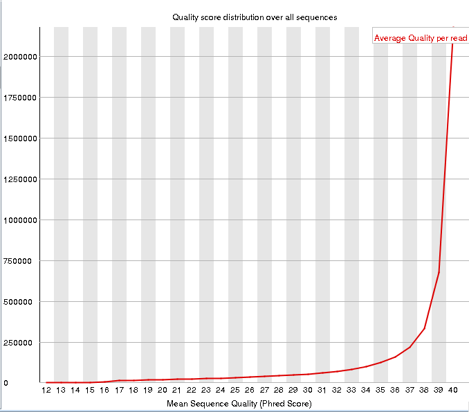
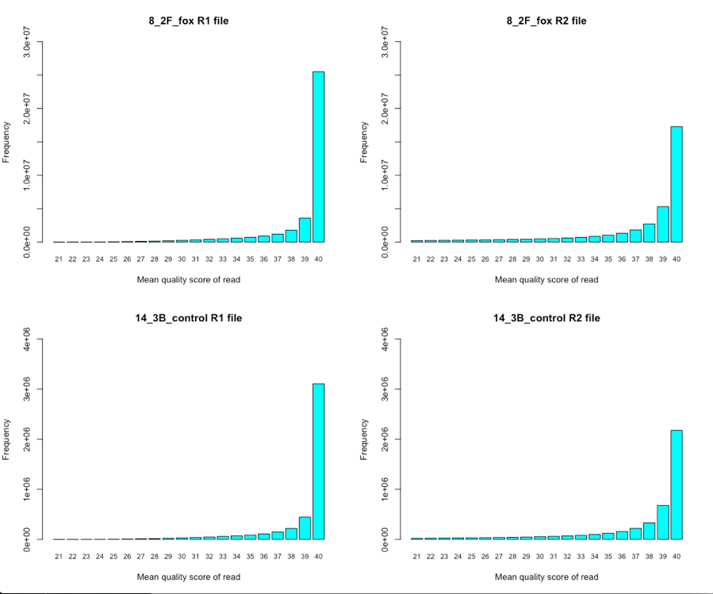

``` {r steup, include=FALSE}
setwd("~/Bi624/sf-seq-qaa-goodez/")
```

**Overview:**

>The objectives of this assignment are to use existing tools for quality assessment and adaptor trimming, compare the quality assessments to those from your own software, and demonstrate your ability to summarize other important information about this RNA-Seq data set.

---

### My assigned files: `14_3B_control` and `8_2F_fox`

## *Part 1 – SF-Seq read quality score distributions*

---

## 1. FastQC Plots

To use FastQC on Talaps:

```
ssh -Y hpc
xrun
ml easybuild intel/2017a FastQC
```

## `14_3B_control` R1 file:


```{r, out.width = "500pt", echo=FALSE}

```


```{r, out.width = "500pt", echo=FALSE}

```

```{r, out.width = "500pt", echo=FALSE}

```

## `14_3B_control` R2 file:


```{r, out.width = "500pt", echo=FALSE}

```


```{r, out.width = "500pt", echo=FALSE}

```

```{r, out.width = "500pt", echo=FALSE}
knitr::include_graphics("Plots/14_3B_R2-N_content.png")
```

---

## `8_2F_fox` R1 file:

```{r, out.width = "500pt", echo=FALSE}

```


```{r, out.width = "500pt", echo=FALSE}

```

```{r, out.width = "500pt", echo=FALSE}

```

## `8_2F_fox` R1 file:

```{r, out.width = "500pt", echo=FALSE}

```

```{r, out.width = "500pt", echo=FALSE}

```

```{r, out.width = "500pt", echo=FALSE}

```

---

## 2. My quality plots:

### Quality by position:

```{r, out.width = "500pt", echo=FALSE}

```

### Quality per sequence:

```{r, out.width = "500pt", echo=FALSE}

```

Overall the FastQC plots are very comparable to my quality plots. There is a clear reduction in general quality in the R2 files. This is seen in the positional plots and also the per-read plots. There are some differences in how the plots are presented, but the content matches up between FastQC and my own.

The runtime for FastQC was significantly faster than my own scripts. This is likely because my scripts rely on python dictionaries and multiple loops that go through every individual read line-by-line. My script is not optimized for speed. 

---

\newpage  
## *Part 2 – Adaptor trimming comparison*

---

## 3. Using `process_shortreads` to trim reads

Process_shortreads was run using the following batch script on Talapas:

~~~~~
#!/bin/bash
#SBATCH --partition=short        ### Partition (like a queue in PBS)
#SBATCH --job-name=proc_short      ### Job Name
#SBATCH --output=proc_short.out         ### File in which to store job output
#SBATCH --error=proc_short.err          ### File in which to store job error messages
#SBATCH --time=0-23:00:00       ### Wall clock time limit in Days-HH:MM:SS
#SBATCH --nodes=1               ### Node count required for the job
#SBATCH --ntasks-per-node=4     ### Number of tasks to be launched per Node

ml easybuild icc/2017.1.132-GCC-6.3.0-2.27 impi/2017.1.132
ml Stacks/1.46

process_shortreads -i gzfastq -1 /projects/bgmp/2017_sequencing/demultiplexed/14_3B_control_S10_L008_R1_001.fastq.gz \
-2 /projects/bgmp/2017_sequencing/demultiplexed/14_3B_control_S10_L008_R2_001.fastq.gz \ -y fastq -o ./ --adapter_1 AGATCGGAAGAGCACACGTCTGAACTCCAGTCAC --adapter_2 AGATCGGAAGAGCGTCGTGTAGGGAAAGAGTGT
~~~~~

Differences between other trimming programs (cutadapt, trimmomatic, process_shortreads)

> One key difference with process_shortreads is that the orphan reads are placed into a separate file (low quality reads). Cutadapt, for instance, throws out both paired reads if one of the reads are bad. Another interesting difference is the way adapter sequences are referenced. For process_shortreads, adapters are input into the command, whereas trimmomatic takes them in as independent sequence files. Another difference is the speed of the programs, which depends partly on their program language. 

#### What proportion of reads was trimmed?

Results from process_shortreads for 14_3B_control R1:

~~~~~~
Total Sequences 72965202
Reads containing adapter sequence       2863302
Ambiguous Barcodes      0
Low Quality     0
Trimmed Reads   2544063
Orphaned Paired-ends    0
Retained Reads  72645963
~~~~~~

This means that **3.48%** of reads were trimmed.

Unfortunately, the process_shortreads did not include summaries for the other sequences, although they were trimmed.

As a sanity check, I used this Unix command to search for adapter sequence in the trimmed and untrimmed files:

`cat <file.fq> | awk ' NR % 4 == 2 ' | grep "AGAGCACACGTCTGAACTCCAG" | wc -l`

Note that the sequence used in the above `grep` command is only part of the forward adapter sequence. I found instances of this sequence even after trimming the R1 files, however this sequence was not found in the R2 files, confirming the expected sequence orientations.

---
\newpage

## 4. Plot the trimmed read length distributions:

```{r trimmed read distribution}
R1_14_lengths <- read.table("14_3B_R1_length_dist.tsv")
R2_14_lengths <- read.table("14_3B_R2_length_dist.tsv")
R1_8_lengths <- read.table("8_2F_R1_length_dist.tsv")
R2_8_lengths <- read.table("8_2F_R2_length_dist.tsv")

R1_14_lengths <- R1_14_lengths[with(R1_14_lengths,order(V1)),]
R2_14_lengths <- R2_14_lengths[with(R2_14_lengths,order(V1)),]
R1_8_lengths <- R1_8_lengths[with(R1_8_lengths,order(V1)),]
R2_8_lengths <- R2_8_lengths[with(R2_8_lengths,order(V1)),]

par(mfrow=c(2,1))
barplot(log(R1_14_lengths$V1), names.arg=R1_14_lengths$V2, cex.names=.7, 
        xlab="Read length", ylab="frequency (log scale)",
        main="14_3B_control R1 trimmed file")

barplot(log(R2_14_lengths$V1), names.arg=R2_14_lengths$V2, cex.names=.7, 
        xlab="Read length", ylab="frequency (log scale)",
        main="14_3B_control R2 trimmed file")
```
\newpage
```{r}
par(mfrow=c(2,1))
barplot(log(R1_8_lengths$V1), names.arg=R1_8_lengths$V2, cex.names=.7, 
        xlab="Read length", ylab="frequency (log scale)",
        main="8_2F_fox R1 trimmed file")

barplot(log(R2_8_lengths$V1), names.arg=R2_8_lengths$V2, cex.names=.7, 
        xlab="Read length", ylab="frequency (log scale)",
        main="8_2F_fox R2 trimmed file")
```

---

\newpage

## 5. Briefly describe whether the adaptor trimming results are consistent with the insert size distributions for your libraries.

Fragment analysis - 14_3B_control

```{r, out.width = "400pt", echo=FALSE}
knitr::include_graphics("frag_anal_14.png")
```

Fragment analysis - 8_2F_fox

```{r, out.width = "400pt", echo=FALSE}
knitr::include_graphics("frag_anal_8.png")
```

The adapters are 140 bp combined. Adding in the 101 bp read makes this 241 bp long. In the above traces, there is very little library under 241 bp. This is consistent with a small amount of trimming by `process_shortreads` (~3% of reads).

---

\newpage

## *Part 3 – rRNA reads and strand-specificity*

---

## 6. Mouse rRNA gsnap

I obtained ncRNA for Mouse from Ensembl, which I then filtered for rRNA using this Unix command:

`cat mouse_ncRNA_rm_newlines.fa | grep "rRNA" -A1 | grep -v "^--" > mouse_rRNA.fa`

>note: I first used an old script on the original ncRNA file to remove new lines within the sequence before running the above command.

The following SLURM script was used to build a database from mouse rRNA. My trimmed reads were then aligned to the database:

~~~~~~
#!/bin/bash
#SBATCH --partition=short        ### Partition (like a queue in PBS)
#SBATCH --job-name=gsnap      ### Job Name
#SBATCH --output=gsnap.out         ### File in which to store job output
#SBATCH --error=gsnap.err          ### File in which to store job error messages
#SBATCH --time=0-23:00:00       ### Wall clock time limit in Days-HH:MM:SS
#SBATCH --nodes=1               ### Node count required for the job
#SBATCH --ntasks-per-node=8     ### Number of tasks to be launched per Node

module load easybuild  GCC/6.3.0-2.27  OpenMPI/2.0.2
module load GMAP-GSNAP/2017-06-20

gmap_build -D ./ -d Mouse ../mouse_rRNA.fa

gsnap -D ../gsnap_8/Mouse -t 8 -O -A sam --split-output 8_2F_fox --allow-pe-name-mismatch \
-d Mouse ../proc_short_out/8_2F_fox_S7_L008_R1_001.1.fq \
../proc_short_out/8_2F_fox_S7_L008_R2_001.2.fq

gsnap -D ../gsnap_8/Mouse -t 8 -O -A sam --split-output 14_3B_control --allow-pe-name-mismatch \
-d Mouse ../proc_short_out/14_3B_control_S10_L008_R1_001.1.fq \
../proc_short_out/14_3B_control_S10_L008_R2_001.2.fq
~~~~~~

I then used the .nomapping files to see how many of the trimmed reads didn't align with mouse rRNA:

`cat 14_3B_control.nomapping | grep -v "^@" | cut -f1 | sort | uniq | wc -l`

The remaining reads are assumed to be mapped to rRNA.

### **% mapped to rRNA**

14_3B_control: 1.028% of reads mapped to rRNA

8_2F_fox: 2.433% of reads mapped to rRNA


## 7. Demonstrate convincingly that the SF-Seq data are from “strand-specific” RNA-Seq libraries

For the forward reads, we should expect more instancs of poly-A, since we enriched for mRNA. I chose to search for repeats of 9 As. To test this I used the following command on all 4 files:

`cat <file.fq> | awk ' NR % 4 ==2  ' | grep "AAAAAAAAA" | wc -l`

### Number of Poly As within each file:

14_3B R1: 27,983

14_3B R2: 31,364

8_2F R1: 224,743

8_2F R2: 270,274

>Interestingly, this approach failed to show that the reads were stranded. Roughly the same number of poly As occured in each file. 